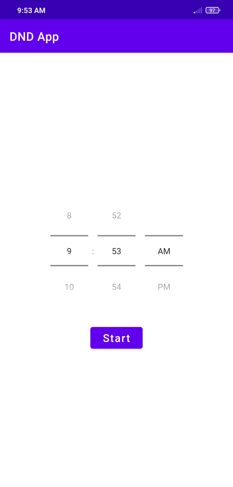
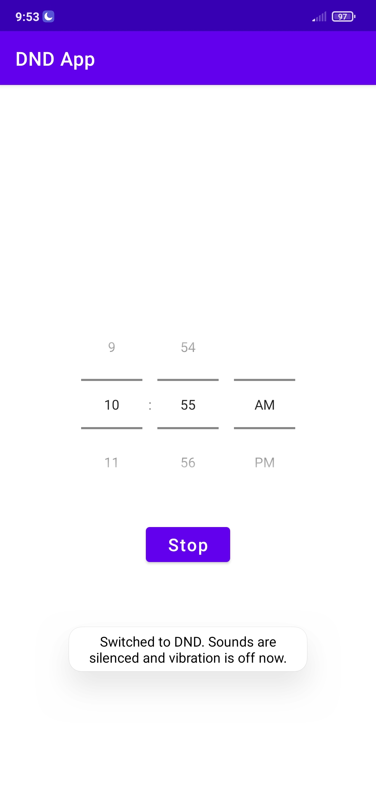
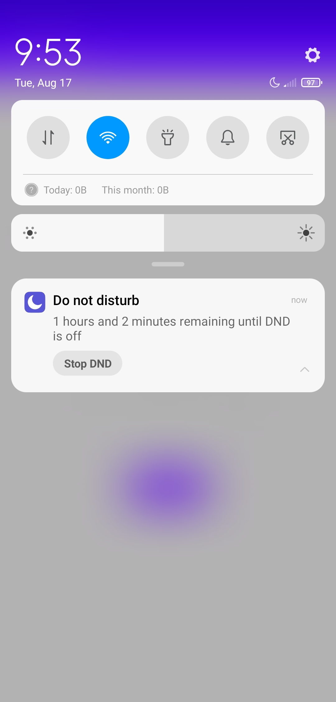

# Do-Not-Disturb-App

Do Not Disturb app for manually set DND mode for android devices


## Getting Started

download the repo as zip file or you can clone it from link below:

```
https://github.com/Ahmed-P-Mostafa/Do-Not-Disturb-App.git
```

### Prerequisites

The things you'll need in order to use the app and how to install them
* You need to accept the app auto start
* allow app do not disturb access


### How to use

  


## Built with

* [Kotlin 1.5.10](https://kotlinlang.org/) - The programming language used
* MVVM - Design Pattern
* Android Service
* RxJava
* Kotlin Flow
* Hilt
* jetpack datastore
* Data-Binding
* binding Adapters

